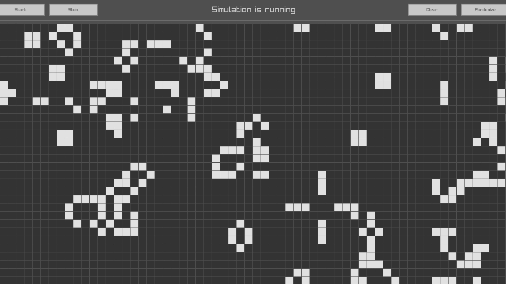
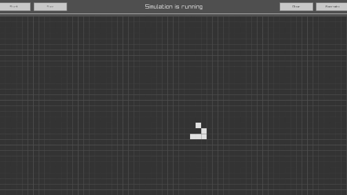
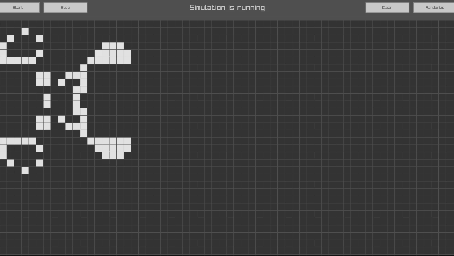

# Game of Life


Game of Life is a simulation game developed in C++ using the Raylib library. It is an implementation of Conway's Game of Life, a cellular automaton devised by the British mathematician John Horton Conway.

## Table of Contents

- [Rules of Game of Life](#rules-of-game-of-life)
- [Prerequisites](#prerequisites)
- [Installation](#installation)
- [Usage](#usage)
- [Examples](#examples)

## Rules of Game of Life

Conway's Game of Life is a cellular automaton devised by the British mathematician John Horton Conway. It consists of a collection of cells which, based on a few mathematical rules, can live, die or multiply. Given the initial state, the cells form various patterns throughout the course of the game.

The simulation follows these rules:

| Rule | Description |
| --- | --- |
| Overpopulation | If a living cell is surrounded by more than three living cells, it dies. |
| Stasis | If a living cell is surrounded by two or three living cells, it survives. |
| Underpopulation | If a living cell is surrounded by fewer than two living cells, it dies. |
| Reproduction | If a dead cell is surrounded by exactly three cells, it becomes a live cell. |

By following these rules, many different types of "creatures" can be created that move around the "grid".

## Prerequisites

- CMake version 3.28 or higher
- C++14 or higher
- Raylib library

## Installation

1. Clone the repository: ```git clone https://github.com/pinkstoney/GameOfLife.git```
2. Navigate to the project directory: ```cd GameOfLife```
3. Build the project using CMake: ```mkdir build cd build cmake .. make```

## Usage

After building the project, you can run the game using the following command:
```./GameOfLife```

## Examples

| Pattern | Preview                                                 | Description |
| --- |---------------------------------------------------------| --- |
| Random |     | A random pattern evolving over time |
| Glider |     | A glider pattern moving across the grid |
| Spaceship  |  | A spaceship pattern traveling in a straight line |
